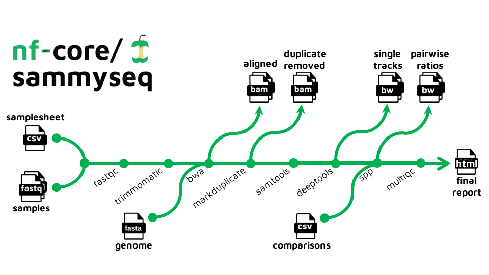

#  

[](https://github.com/nf-core/sammyseq/actions?query=workflow%3A%22nf-core+CI%22)
[](https://github.com/nf-core/sammyseq/actions?query=workflow%3A%22nf-core+linting%22)[](https://nf-co.re/sammyseq/results)[](https://doi.org/10.5281/zenodo.XXXXXXX)

[](https://www.nextflow.io/)
[](https://docs.conda.io/en/latest/)
[](https://www.docker.com/)
[](https://sylabs.io/docs/)
[](https://tower.nf/launch?pipeline=https://github.com/nf-core/sammyseq)

[](https://nfcore.slack.com/channels/sammyseq)[](https://twitter.com/nf_core)[](https://mstdn.science/@nf_core)[](https://www.youtube.com/c/nf-core)

## Introduction

**nf-core/sammyseq** is a bioinformatics pipeline for the analysis of Sequential Analysis of MacroMolecules accessibilitY sequencing (SAMMY-seq) data, a cheap and effective methodology to analyze chromatin state as described in:

> Sebestyén, E., Marullo, F., Lucini, F. et al. SAMMY-seq reveals early alteration of heterochromatin and deregulation of bivalent genes in Hutchinson-Gilford Progeria Syndrome. Nat Commun 11, 6274 (2020). https://doi.org/10.1038/s41467-020-20048-9. [Pubmed](https://pubmed.ncbi.nlm.nih.gov/33293552/)

:::warning

Please note that this pipeline is under active development and has not been released yet.

:::

Here is an outline of the analysis steps:

1. Read QC ([`FastQC`](https://www.bioinformatics.babraham.ac.uk/projects/fastqc/))
2. Trim reads to remove adapter sequences and low quality ends ([`Trimmomatic`](http://www.usadellab.org/cms/?page=trimmomatic))
3. Align on a reference genome ([`BWA`](https://bio-bwa.sourceforge.net/))
4. Remove duplicate reads ([`picard Markduplicates`](http://broadinstitute.github.io/picard))
5. Generate alignment statistics ([`samtools`](http://www.htslib.org/))
6. Create single track profiles in bigwig format ([`deeptools`](https://deeptools.readthedocs.io/en/develop/))
7. (Optionally) Generate pairwise comparison tracks in bigwig format if provided a list of the desired sample pairs ([`spp`])
8. Generate an analysis report by collecting all generated QC and statistics ([`MultiQC`](http://multiqc.info/))

<p align="center">
    
</p>

## Usage

:::note
If you are new to Nextflow and nf-core, please refer to [this page](https://nf-co.re/docs/usage/installation) on how
to set-up Nextflow. Make sure to [test your setup](https://nf-co.re/docs/usage/introduction#how-to-run-a-pipeline)
with `-profile test` before running the workflow on actual data.
:::

First, prepare a samplesheet with your input data that looks as follows:

`samplesheet.csv`:

```csv
sample,fastq_1,fastq_2,experimentalID,fraction
CTRL004_S2,/home/sammy/test_data/CTRL004_S2_chr22only.fq.gz,,CTRL004,S2
CTRL004_S3,/home/sammy/test_data/CTRL004_S3_chr22only.fq.gz,,CTRL004,S3
CTRL004_S4,/home/sammy/test_data/CTRL004_S4_chr22only.fq.gz,,CTRL004,S4
```

Each row represents a fastq file (single-end) or a pair of fastq files (paired end), `experimentalID` represents the biological specimen of interest and `sample` the library produced for each fraction, it usually is a unique combination of `experimentalID` and `fraction`.

Now, you can run the pipeline using:

```bash
nextflow run nf-core/sammyseq \
   -profile <docker/singularity/.../institute> \
   --fasta reference_genome.fa \
   --input samplesheet.csv \
   --outdir <OUTDIR>
```

or

```bash
nextflow run nf-core/sammyseq \
   -profile <docker/singularity/.../institute> \
   --fasta reference_genome.fa \
   --input samplesheet.csv \
   --outdir <OUTDIR> \
   --comparisonFile comparisons.csv
```

:::warning
Please provide pipeline parameters via the CLI or Nextflow `-params-file` option. Custom config files including those
provided by the `-c` Nextflow option can be used to provide any configuration _**except for parameters**_;
see [docs](https://nf-co.re/usage/configuration#custom-configuration-files).
:::

For more details and further functionality, please refer to the [usage documentation](https://nf-co.re/sammyseq/usage) and the [parameter documentation](https://nf-co.re/sammyseq/parameters).

## Pipeline output

<!-- TODO uncomment after first release: To see the results of an example test run with a full size dataset refer to the [results](https://nf-co.re/sammyseq/results) tab on the nf-core website pipeline page. -->

For more details about the output files and reports, please refer to the
[output documentation](https://nf-co.re/sammyseq/output).

## Credits

nf-core/sammyseq was written by Lucio Di Filippo and Margherita Mutarelli and was based on the original pipeline developed _in-house_ by SAMMY-seq creators. <!-- TODO retreive all names and github usernames -->

We thank the following people for their extensive assistance in the development of this pipeline:

<!-- TODO nf-core: If applicable, make list of people who have also contributed -->

## Acknowledgements

The development of this pipeline was made possible thanks to the projects Progetti@CNR Myo-CoV-2 B93C20046330005, AFM Téléthon EDMD-GenomeSCAN B53C22009260007 and PIR01_00011 I.Bi.S.Co. Infrastruttura per Big data e Scientific COmputing (PON 2014-2020).

## Contributions and Support

If you would like to contribute to this pipeline, please see the [contributing guidelines](.github/CONTRIBUTING.md).

For further information or help, don't hesitate to get in touch on the [Slack `#sammyseq` channel](https://nfcore.slack.com/channels/sammyseq) (you can join with [this invite](https://nf-co.re/join/slack)).

## Citations

<!-- TODO nf-core: Add citation for pipeline after first release. Uncomment lines below and update Zenodo doi and badge at the top of this file. -->
<!-- If you use  nf-core/sammyseq for your analysis, please cite it using the following doi: [10.5281/zenodo.XXXXXX](https://doi.org/10.5281/zenodo.XXXXXX) -->

An extensive list of references for the tools used by the pipeline can be found in the [`CITATIONS.md`](CITATIONS.md) file.

You can cite the `nf-core` publication as follows:

> **The nf-core framework for community-curated bioinformatics pipelines.**
>
> Philip Ewels, Alexander Peltzer, Sven Fillinger, Harshil Patel, Johannes Alneberg, Andreas Wilm, Maxime Ulysse Garcia, Paolo Di Tommaso & Sven Nahnsen.
>
> _Nat Biotechnol._ 2020 Feb 13. doi: [10.1038/s41587-020-0439-x](https://dx.doi.org/10.1038/s41587-020-0439-x).
